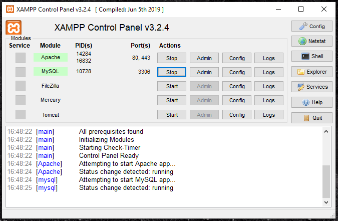

# sortDnD
Web-based drag-and-drop UI to sort and save data in a database processed by a server (PHP, SQL, jQuery).

## Concept 
The web-browser requests data from the server on the website load; after that the server sends query to the SQL database and echoes the data back to the client, so it can be displayed in the user's web-browser.

Every change in the sorting is sent on drop of the element to the server and the server updates the data in the database.   

## Prerequisites
To execute the code as designed you will need the following:
- MySQL database
- Server with PHP
- Chrome with Chrome-Logger extension
- Chrome-Logger library ([Link](https://craig.is/writing/chrome-logger))  

## Run with XAMPP

XAMPP is a free and open-source cross-platform web server development solution ([Link](https://www.apachefriends.org/index.html)). 

After intalling XAMPP, place the project files in directory "htdocs", eg "C:\xampp\htdocs\sortDnD".

If you want to use the Chrome-Looger, note that the library is expected at "C:\xampp\htdocs\_chromephp-master" where the project files from [this GitHub-project](https://github.com/ccampbell/chromephp) need to be saved. Additionally, you need to enable the Chrome-Logger extension (see the link in prerequisites above).

Start the Apache and MySQL in XAMPP:

By default, the XAMPP-server has IP 127.0.0.1, your project files are then available at URL http://127.0.0.1/sortDnD/. (Note: although the files are available through localhost as well, not all scripts are executable.)

The UI is in "webpage.html.

The contents and details of the MySQL databases running in the background are by default available at http://127.0.0.1/phpmyadmin/

## License
This project is released under the MIT license.